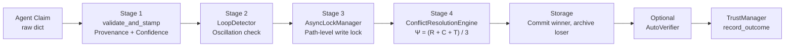
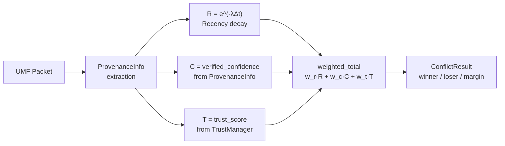
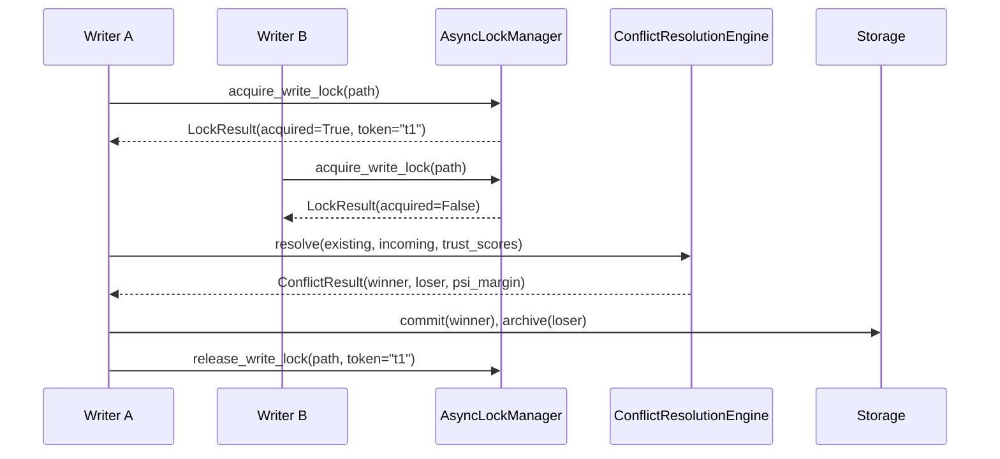
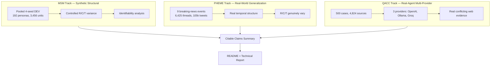

# Conflict Resolution Tracer (CRT)

<p align="center">
  
</p>

**Conflict Resolution Tracer (CRT)** is deterministic multi-agent memory coherence middleware. It resolves conflicting writes to the same memory key using a fixed algebraic formula Ψ = (R + C + T) / 3, where R is recency decay, C is provenance-derived confidence, and T is dynamic agent trust. Provenance is a mandatory Stage-1 audit layer; it does not contribute a scalar term to Ψ.

This repository contains the core engine, service layer, client SDK, and three independent evaluation tracks: MSM (synthetic-structural), PHEME (real-world generalization), and QACC (real-agent multi-provider). The results are mixed: the mechanism is engineering-rigorous and fully reproducible, but accuracy on open-domain real-world data is modest, and several components are structurally unidentifiable on current benchmarks.

---

## Key Findings

| Finding | Track | Result | Source |
|---------|-------|--------|--------|
| **PHEME underperformance** | PHEME | crt_v1 strict accuracy 13.0% vs last_write_wins 16.0%; coverage 73.7% vs 100% | `PHEME_FINAL_EVALUATION_REPORT.md` |
| **QACC neutral R/T limitation** | QACC | R and T are structurally neutral (0.5) on QACC; only C differentiates. This is a dataset property, not a bug. | `QACC_500_MULTIPROVIDER_RESULTS.md` |
| **MSM flat C/T sensitivity** | MSM | C/T weight-ratio sweep is remarkably flat (±1.5pp accuracy across full grid). Peak at C/T=0.2 is only 0.015 above worst point. | `SWEEP_PLAN_RESULTS.md` §A2 |
| **C-vs-T contradiction reversed** | MSM | Joint full_crt/c_only accuracy (0.6943) exceeds t_only (0.6853) on same episodes. "Confident but wrong together" explanation unsupported. | `SWEEP_PLAN_EVIDENCE_ADDENDUM.md` |
| **QACC openai win-share** | QACC | OpenAI wins 53/102 resolved cases (51.96%) vs 42.85% source share, ratio 1.21 (Wilson 95% CI [0.424, 0.614]). Driven by longer claims, not higher authority. | `QACC_500_MULTIPROVIDER_RESULTS.md` §4.2 |
| **QACC agreement (measurable)** | QACC | 3/7 = 42.86% agreement on measurable triples (Wilson 95% CI [0.158, 0.750]). Original 0/30 figure unreliable due to groq rate-limit failures. | `QACC_500_MULTIPROVIDER_RESULTS.md` §4.4 |
| **Provider-blind resolver** | QACC | 0 authority mismatches across 4,823 assertions. authority_score depends only on source_type, never provider identity. | `QACC_500_MULTIPROVIDER_RESULTS.md` §4.3 |
| **Agent-claim gap** | MSM | 0/3,337 simulated agent wins against grounded evidence. Empirically robust on this corpus, but NOT arithmetically guaranteed. | `SWEEP_PLAN_RESULTS.md` §A4 |
| **Seed pooling** | MSM | Pooling 4 seeds does not change identifiability picture. Structural variance is identical across seeds. | `00_SEED_POOLING_REPORT.md` |
| **Pending conflict** | Real-agents | Concurrent mode produces spurious pending_conflict on distinct paths due to middleware race. | `B2_pending_conflict_evidence.json` |

---

## Architecture

### Four-stage pipeline



### Ψ calculation flow



### Concurrency / locking sequence



### Evaluation architecture



**What each track can and cannot test:**

| Track | Can test | Cannot test |
|-------|----------|-------------|
| MSM | Structural identifiability of R, C, T components; weight sensitivity; guardrail behavior in controlled settings | Real-world extraction quality; provider behavior; temporal signal fidelity |
| PHEME | Generalization to real-world rumor verification; whether R/C/T help when they genuinely vary | Trust calibration (single-domain Twitter data); stance extraction quality (deterministic lexicon) |
| QACC | Real conflicting web evidence; multi-provider extraction behavior; provider-blind resolver verification | Recency/trust signal (structurally neutral on this dataset); groq model quality (rate-limited) |

---

## Quickstart

```bash
# Clone
git clone https://github.com/your-org/conflict-resolution-tracer.git
cd conflict-resolution-tracer

# Install core
pip install -e crt_core
pip install -e crt_service
pip install -e crt_client

# Run tests
pytest tests/

# Start service (research mode)
CRT_EVALUATION_MODE=1 python -m uvicorn crt_service.app:app --host 0.0.0.0 --port 8000
```

### Configuration

Core behavior is controlled via environment variables:

| Variable | Purpose | Default |
|----------|---------|---------|
| `CRT_EVALUATION_MODE` | Enable research/evaluation mode | `0` (production) |
| `CRT_SQLITE_PATH` | SQLite database path | `:memory:` |
| `CRT_RESOLUTION_POLICY` | Conflict resolution policy | `full_crt` |
| `CRT_ALLOW_DEV_EVIDENCE_KEY` | Allow dev evidence key for testing | `0` |
| `OPEN_AI_KEY` | OpenAI API key for QACC extraction | — |
| `GROK_API_KEY` | Groq API key for QACC extraction | — |

---

## Evaluation Methodology

This project uses three independent evaluation tracks. All results are frozen artifacts in `results/empirical_evaluation/`.

### MSM (Synthetic Structural)
- **Dataset:** Pooled 4-seed DEV (192 personas, 3,456 units, 8,919 claims)
- **Method:** Deterministic structural readouts via `msm_deriver.py`
- **Key scripts:** `run_clean_dev_pooled.py`, `_run_full_sweep.py`
- **Full report:** `results/empirical_evaluation/msm/_sweep_results/SWEEP_PLAN_RESULTS.md`

### PHEME (Real-World Generalization)
- **Dataset:** PHEME (Zubiaga et al. 2016), 9 events, 6,425 threads, 105,354 tweets
- **Method:** Deterministic stance extraction + CRT V1 conflict resolution
- **Full report:** `results/empirical_evaluation/pheme_test/PHEME_FINAL_EVALUATION_REPORT.md`

### QACC (Real-Agent Multi-Provider)
- **Dataset:** Amazon Science QACC (NAACL 2025), 500 cases, 4,824 sources
- **Method:** Multi-provider extraction (OpenAI, Ollama, Groq) with round-robin assignment; frozen assertions replayed through 6 policies
- **Key scripts:** `research_evaluation/qacc_mp/`
- **Full report:** `results/empirical_evaluation/component_evaluation/qacc/_frozen_assertions_500_multiprovider/QACC_500_MULTIPROVIDER_RESULTS.md`

---

## Repository Structure

```
conflict-resolution-tracer-FRESH/
├── crt_core/                    # Core library (conflict, provenance, confidence, locking, etc.)
├── crt_service/                 # Service layer (FastAPI app, SQLite storage)
├── crt_client/                  # Client SDK
├── qacc/raw/                    # QACC dataset (ConflictQA_Dataset.json)
├── research_data/               # Benchmark seed/data corpora
├── research_evaluation/         # Evaluation scripts
│   ├── qacc_mp/                 # QACC multiprovider pipeline (reusable)
│   ├── frozen_artifacts.py      # Artifact handling
│   ├── msm_deriver.py           # MSM deriver
│   └── multisource_memory_adapter.py
├── results/                     # All empirical outputs
│   └── empirical_evaluation/
│       ├── msm/                 # MSM results (sweep, seed pooling)
│       ├── pheme_test/          # PHEME results
│       ├── qacc/                # QACC results (500-multiprovider, initial)
│       ├── provenance/          # Provenance evaluation
│       └── ground_truth/        # Ground truth data
├── tests/                       # Unit + integration tests
├── docs/                        # Documentation, figures, technical report
├── scripts/                     # Data-fetch utilities
├── .github/                     # CI configuration
├── .env                         # Secrets/config (not committed)
├── README.md                    # This file
└── LICENSE                      # [To be specified]
```

---

## Limitations

This section is not buried. These are genuine constraints that affect how the results should be interpreted.

1. **PHEME underperformance:** crt_v1 (13.0% strict accuracy) loses to simple baselines like last_write_wins (16.0%) and recency_only (16.0%). The mechanism does not outperform naive strategies on this real-world rumor verification task.

2. **QACC neutral trust/recency:** QACC provides no real trust or temporal signal. R and T are structurally fixed at 0.5 for every claim. Only C = authority_score(source_type) differentiates. This is a property of the dataset, not a code bug. Any policy that weights R or T differently cannot be properly evaluated on QACC.

3. **MSM flat C/T sensitivity:** The C/T weight ratio is not a high-leverage parameter on MSM. Sweeping it from 0.1 to 10.0 produces less than 1.5 percentage points of accuracy variation. The current 1/3-1/3-1/3 default sits on a broad, stable plateau.

4. **QACC low coverage:** full_crt resolves only 20.61% of QACC cases (102/495). The mechanism is highly abstentious on open-domain conflicting contexts.

5. **Groq rate-limit data quality:** 84.4% of groq-assigned QACC sources failed with HTTP 429 transport errors. No cross-provider comparison can include groq for this run.

6. **No G-subweight decomposition:** The current implementation has no provenance-aware G-component. EVIDENCE_AUTHORITY is flat per source type. C variance comes only from coverage differences.

7. **Guardrail inactivity:** The high-confidence-untrusted guardrail fired 0 times in 1,995 resolved episodes. It provides no safety value on current datasets.

8. **Pending conflict in concurrent mode:** The real_agents track found that concurrent mode produces spurious pending_conflict outcomes on distinct paths due to a middleware race. Serial mode is deterministic; concurrent mode is not for equal-authority real-agent claims.

9. **Agent-claim framing:** The 0/3,337 agent-claim result on MSM is empirically robust but not arithmetically guaranteed. It holds because favorable R/T conditions (R=1.0, T=1.0) do not occur in this corpus, not because the authority gap alone makes it impossible.

---

## Citation

If you use this repository or its results in academic work, please cite the relevant track reports directly:

- **MSM:** `results/empirical_evaluation/msm/_sweep_results/SWEEP_PLAN_RESULTS.md`
- **PHEME:** `results/empirical_evaluation/pheme_test/PHEME_FINAL_EVALUATION_REPORT.md`
- **QACC:** `results/empirical_evaluation/component_evaluation/qacc/_frozen_assertions_500_multiprovider/QACC_500_MULTIPROVIDER_RESULTS.md`
---


