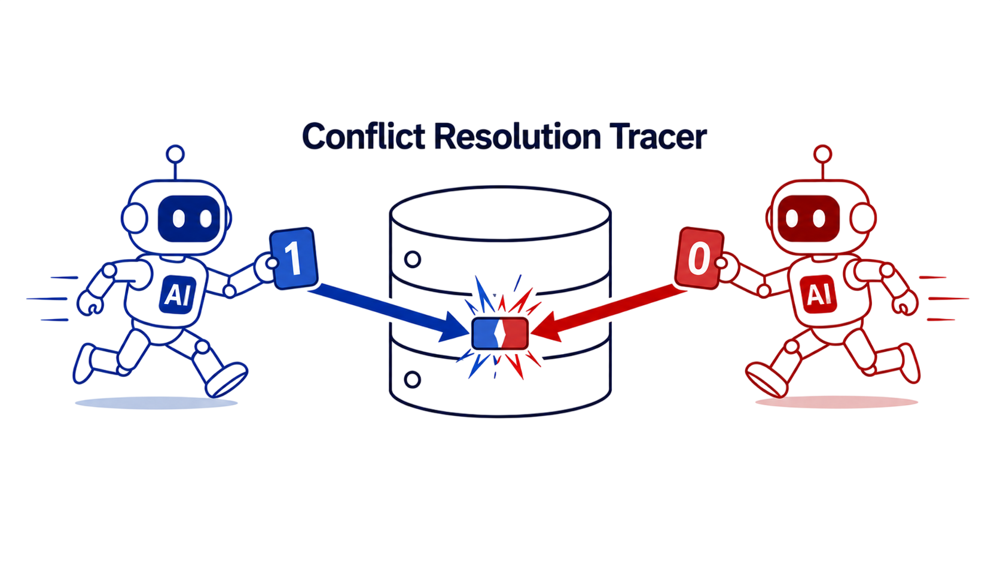
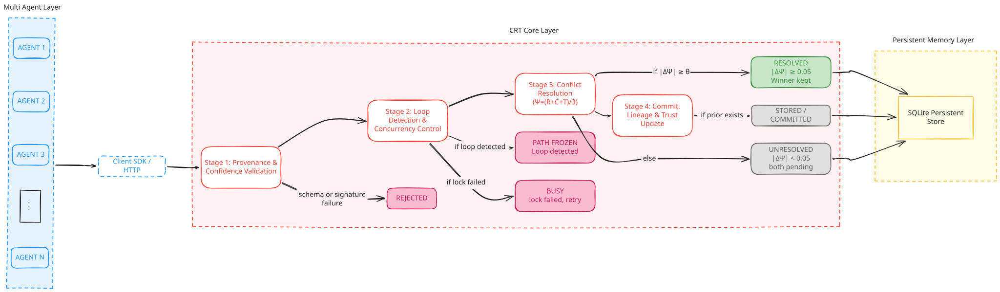
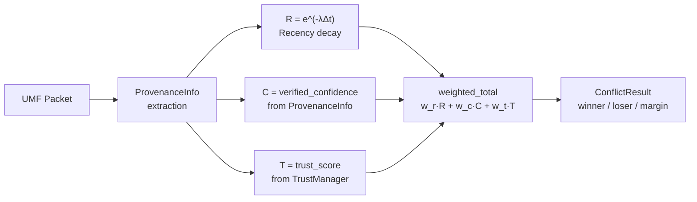
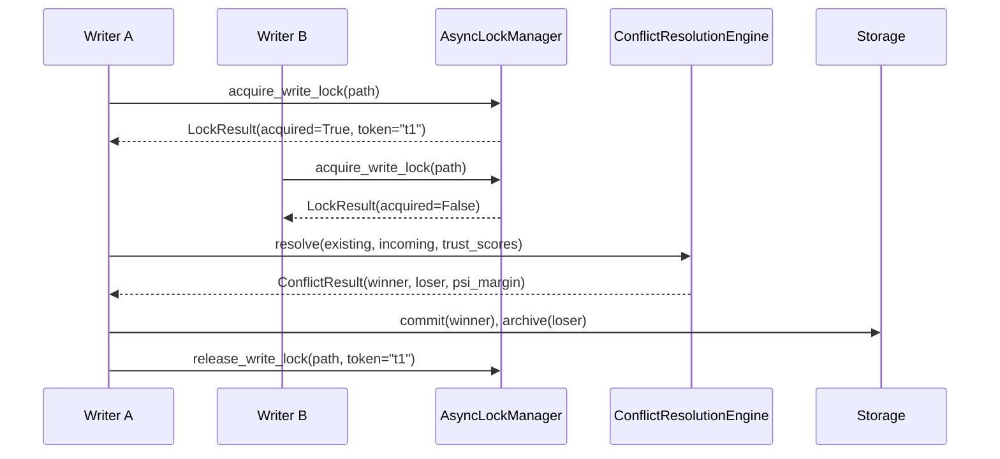
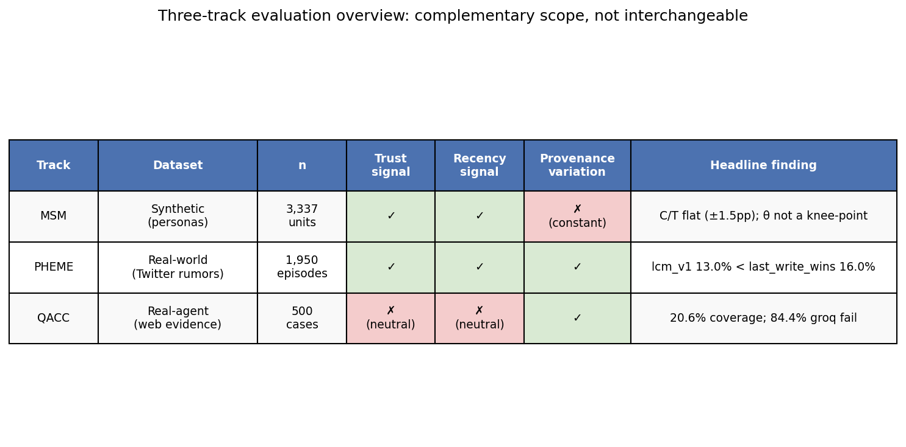

# Conflict Resolution Tracer (CRT)

## 🧭 Overview
This repository contains the official implementation and full empirical evaluation of **CRT (Conflict Resolution Tracer)**, a **deterministic middleware for Shared Memory in Multi-Agent LLM Systems**.

The work addresses the absence of a reconciliation layer in current multi-agent frameworks, where conflicting agent writes are resolved by ad-hoc heuristics (last-write-wins, LLM-as-judge) that are non-deterministic, unauditable, or silently destructive.

CRT resolves conflicting writes to the same memory key using a fixed algebraic formula:

**Ψ = (R + C + T) / 3**

where **R** is recency decay, **C** is provenance-derived confidence, and **T** is dynamic agent trust. 

This repo is a **complete research artifact**, not just a code drop: it contains the core engine, service layer, client SDK, and three independent, frozen evaluation tracks (MSM, PHEME, QACC), with all results reported.

## 📄 Abstract

CRT implements a four-stage write pipeline: (1) provenance validation, (2) oscillation detection and per-path locking, (3) conflict resolution via Ψ = (R + C + T)/3 with margin-based abstention (τ = 0.05), and (4) lineage tracking with loser archival. The system is evaluated on three independent tracks: MSM (synthetic structural benchmark, 3,337 claims), PHEME (real-world rumor verification, 1,950 episodes), and QACC (multi-provider QA, 495 cases). 

CRT significantly reduces incorrect-overwrite rates on QACC (−67.8%) and MSM (−45.3%) but does not significantly improve selective accuracy on PHEME or QACC. All results are frozen and fully reproducible.

## 🎯 Research Objectives
- **RQ1 (Reproducibility):** Can conflicting claims be adjudicated so identical inputs yield identical, explainable outcomes?
- **RQ2 (Concurrency):** Can concurrent writes be sequenced and reconciled without inter-agent coordination?
- **RQ3 (Manipulation Resistance):** Can legitimacy-by-repetition and spoofed authority be prevented?
- **RQ4 (Auditability):** Can provenance and trust be modeled so decisions remain auditable over time and across domains?

## 🧠 Proposed Solution (Architecture)

<p align="center">
  
</p>

**Figure 1.** The four-stage deterministic write pipeline. Every incoming agent claim passes through provenance/confidence stamping, loop detection, path-level locking, and finally Ψ-based conflict resolution before being committed to storage. An optional AutoVerifier can feed outcomes back into the TrustManager, which updates T for future resolutions.

- **Stage 1 — `validate_and_stamp`:** mandatory provenance audit + confidence (C) extraction. 
- **Stage 2 — `LoopDetector`:** oscillation check to prevent repeated conflicting writes from cycling.
- **Stage 3 — `AsyncLockManager`:** path-level write lock, serializing concurrent writers to the same key.
- **Stage 4 — `ConflictResolutionEngine`:** computes Ψ = (R + C + T) / 3 and commits the winner, archiving the loser.

### Ψ calculation flow


- **R (Recency):** Exponential decay R = e^(-λΔt) with track-specific half-life (24h default, 30d MSM).
- **C (Confidence):** Middleware-verified, provenance-derived; never agent-reported.
- **T (Trust):** Per-agent, per-domain Wilson 95% lower bound, 30-day decay to neutral 0.5, strict domain isolation.

### Concurrency / locking sequence


## 📂 Datasets

CRT is evaluated on **three independent tracks**, each with a different data provenance profile.

### MSM — Synthetic Structural
- **Source:** [Multi-Source Memory Benchmark](https://huggingface.co/datasets/anon-neuripsed26/multisource-memory-benchmark) (Hugging Face), 100% synthetic personas (192 personas / 3,456 units used here, pooled across 4 seeds, drawn from the full released benchmark).
- **Scale:** 4 seeds × 192 personas × 3,456 units = 3,337 claim-bearing episodes
- **Format:** Deterministic structural readouts via `msm_deriver.py` 
- **Purpose:** controlled R/C/T variance to test structural identifiability in isolation from real-world noise.

### PHEME — Real-World Generalization
- **Source:** [PHEME dataset of rumours and non-rumours](https://figshare.com/articles/dataset/PHEME_dataset_of_rumours_and_non-rumours/4010619) (Zubiaga, Wong Sak Hoi, Liakata & Procter, 2016), 9 breaking-news events, 6,425 threads, 105,354 tweets.
- **Scale:** 9 breaking-news events, 6,425 threads, 105,354 tweets → 1,950 evaluable episodes
- **Format:** Event- and thread-level veracity labels (journalist-annotated)
- **Purpose:** tests generalization to real-world rumor verification where R/C/T genuinely vary.

### QACC — Real-Agent Multi-Provider
- **Source:** `ConflictQA_Dataset.json`, sourced from [amazon-science/qa-with-conflicting-context](https://github.com/amazon-science/qa-with-conflicting-context), the official repository accompanying:
  > Liu, S., Ning, Q., Halder, K., Xiao, W., Qi, Z., Htut, P.M., Zhang, Y., John, N.A., Min, B., Benajiba, Y., & Roth, D. (2025). *Open Domain Question Answering with Conflicting Contexts.* NAACL 2025.
- **Scale:** 500 cases, 4,824 sources, 3 providers (OpenAI, Ollama, Groq round-robin)
- **Format:** Real conflicting web evidence; frozen assertions replayed through 6 policies
- **Key property:** R and T structurally neutral (0.5); only C differentiates
- **Purpose:** 500 cases, 4,824 sources, evaluated across 3 LLM providers (OpenAI, Ollama, Groq) with round-robin assignment; tests real conflicting web evidence and provider-blind resolution.

📁 **Directory structure:**
```
qacc/raw/                    # QACC dataset (ConflictQA_Dataset.json) 
research_data/                # MSM benchmark  
results/empirical_evaluation/pheme_test/   # PHEME-derived evaluation artifacts 
```

## Data Preparation Per Track
Each track uses a different, deterministic preparation method, there is no shared preprocessing pipeline across tracks, by design, since each track tests a different failure mode:

- **MSM:** deterministic structural readouts via `msm_deriver.py`; R/C/T are directly controlled rather than extracted.
- **PHEME:** deterministic, lexicon-based stance extraction (no learned model), with the extracted stances used as inputs to CRT conflict resolution.
- **QACC:** multi-provider LLM extraction (OpenAI, Ollama, Groq) with round-robin assignment; frozen assertions are replayed through 6 resolution policies for fair comparison.

## Project Structure
```
conflict-resolution-tracer/
├── crt_core/                    # Core library (conflict, provenance, confidence, locking, etc.)
├── crt_service/                 # Service layer (FastAPI app, SQLite storage)
├── crt_client/                  # Client SDK
├── qacc/raw/                    # QACC dataset (ConflictQA_Dataset.json)
├── research_data/               # Benchmark seed/data corpora
├── research_evaluation/         # Evaluation scripts
│   ├── qacc_mp/                 # QACC multiprovider pipeline (reusable)
│   ├── frozen_artifacts.py      # Artifact handling
│   ├── msm_deriver.py           # MSM deriver
│   └── multisource_memory_adapter.py
├── results/                     # All empirical outputs
│   └── empirical_evaluation/
│       ├── msm/                 # MSM results (sweep, seed pooling)
│       ├── pheme_test/          # PHEME results
│       ├── qacc/                # QACC results (500-multiprovider, initial)
│       ├── provenance/          # Provenance evaluation
│       └── ground_truth/        # Ground truth data
├── tests/                       # Unit + integration tests
├── docs/                        # Documentation, figures
├── scripts/                     # Data-fetch utilities
├── .github/                     # CI configuration
├── .env                         # Secrets/config 
├── README.md                    # This file
└── LICENSE
```

## Running the Evaluation

### Setup
```bash
git clone https://github.com/Maryem-Jlassi/conflict-resolution-tracer.git
cd conflict-resolution-tracer

pip install -e crt_core
pip install -e crt_service
pip install -e crt_client
pip install -r requirements.txt  # matplotlib, scipy, numpy, pandas

```

### Start the service (research mode)
```bash
CRT_EVALUATION_MODE=1 python -m uvicorn crt_service.app:app --host 0.0.0.0 --port 8000
```

### Configuration
| Variable | Purpose | Default |
|----------|---------|---------|
| `CRT_EVALUATION_MODE` | Enable research/evaluation mode | `0` (production) |
| `CRT_SQLITE_PATH` | SQLite database path | `:memory:` |
| `CRT_RESOLUTION_POLICY` | Conflict resolution policy | `full_crt` |
| `CRT_ALLOW_DEV_EVIDENCE_KEY` | Allow dev evidence key for testing | `0` |
| `OPEN_AI_KEY` | OpenAI API key for QACC extraction | — |
| `GROK_API_KEY` | Groq API key for QACC extraction | — |

## 🧪 Evaluation

```bash
pytest tests/
```

Each track is run independently, with its own frozen dataset and reproducible script:

| Track | Dataset | Method | Key scripts | Full report |
|-------|---------|--------|-------------|-------------|
| **MSM** | Pooled 4-seed DEV (192 personas, 3,456 units, 8,919 claims) | Deterministic structural readouts | `run_clean_dev_pooled.py`, `_run_full_sweep.py` | `results/empirical_evaluation/msm/_sweep_results/SWEEP_PLAN_RESULTS.md` |
| **PHEME** | 9 events, 6,425 threads, 105,354 tweets | Deterministic stance extraction + CRT | — | `results/empirical_evaluation/pheme_test/PHEME_FINAL_EVALUATION_REPORT.md` |
| **QACC** | 500 cases, 4,824 sources | Multi-provider extraction + 6 policies replayed on frozen assertions | `research_evaluation/qacc_mp/` | `results/empirical_evaluation/component_evaluation/qacc/_frozen_assertions_500_multiprovider/QACC_500_MULTIPROVIDER_RESULTS.md` |

**What each track can and cannot test:**

| Track | Can test | Cannot test |
|-------|----------|-------------|
| MSM | Structural identifiability of R, C, T; weight sensitivity; guardrail behavior in controlled settings | Real-world extraction quality; provider behavior; temporal signal fidelity |
| PHEME | Generalization to real-world rumor verification; whether R/C/T help when they genuinely vary | Trust calibration (single-domain Twitter data); stance extraction quality (deterministic lexicon) |
| QACC | Real conflicting web evidence; multi-provider extraction behavior; provider-blind resolver verification | Recency/trust signal (structurally neutral on this dataset); groq model quality (rate-limited) |

## 📊 Results & Discussion

<p align="center">  </p>

**Figure 2.** MSM, PHEME, and QACC are complementary, not interchangeable: trust and recency signal genuinely vary in MSM and PHEME but are structurally neutral on QACC, while provenance only genuinely varies in PHEME and QACC.

### Metrics

- **Coverage:** decided / all cases
- **Strict Accuracy:** correctly resolved / all cases (penalizes abstention)
- **Selective Accuracy:** correct / decided
- **Incorrect Overwrite Rate:** wrong winner / decided (when gold exists)
- **Statistical tests:** Wilson 95% CI for rates; two-proportion z-test for differences

### Quantitative Results

| Track | Selective Accuracy (CRT vs LWW) | Overwrite Rate (CRT vs LWW) | Significance |
|---|---:|---:|---|
| **MSM** | 69.2% vs 58.8% | 12.7% vs 23.3% (−45.3%) | ✅ *p* < 10⁻⁴ |
| **QACC** | 42.2% vs 38.4% | 3.9% vs 12.2% (−67.8%) | ✅ *p* = 0.015 (overwrite) |
| **PHEME** | 17.7% vs 16.0% | — | ⚠️ n.s. (*p* = 0.20) |

### Key Findings (Strict Accuracy Focus)

| Finding | Track | Result |
|---------|-------|--------|
| PHEME underperformance | PHEME | crt_v1 strict accuracy 13.0% vs. last_write_wins 16.0%; coverage 73.7% vs. 100% |
| QACC neutral R/T | QACC | R and T are structurally neutral (0.5) on QACC; only C differentiates — a dataset property, not a bug |
| MSM flat C/T sensitivity | MSM | C/T weight-ratio sweep is flat (±1.5pp accuracy across full grid); peak at C/T=0.2 only 0.015 above worst point |
| C-vs-T contradiction reversed | MSM | full_crt/c_only accuracy (0.6943) exceeds t_only (0.6853) on the same episodes |
| QACC OpenAI win-share | QACC | 53/102 resolved cases (51.96%) vs. 42.85% source share, ratio 1.21 (Wilson 95% CI [0.424, 0.614]) |
| QACC agreement (measurable) | QACC | 3/7 = 42.86% agreement on measurable triples (Wilson 95% CI [0.158, 0.750]) |
| Provider-blind resolver | QACC | 0 authority mismatches across 4,823 assertions |
| Agent-claim gap | MSM | 0/3,337 simulated agent wins against grounded evidence — empirically robust, not arithmetically guaranteed |
| Pending conflict | Real-agents | Concurrent mode produces spurious `pending_conflict` on distinct paths due to a middleware race |

## ⚙️ Environment & Dependencies

### Software Requirements
- Python 3.12 
- FastAPI + SQLite (service layer)
- Ollama, for local-model agent demos

### Python Dependencies
```bash
pip install -e crt_core
pip install -e crt_service
pip install -e crt_client
```

## 🧩 Limitations

1. **PHEME underperformance:** crt (13.0% strict accuracy) loses to simple baselines like `last_write_wins` (16.0%) and `recency_only` (16.0%). The mechanism does not outperform naive strategies on this real-world rumor verification task.
2. **QACC neutral trust/recency:** QACC provides no real trust or temporal signal. R and T are structurally fixed at 0.5 for every claim; only C = `authority_score(source_type)` differentiates. This is a property of the dataset, not a code bug.
3. **MSM flat C/T sensitivity:** the C/T weight ratio is not a high-leverage parameter on MSM, sweeping it from 0.1 to 10.0 produces less than 1.5 percentage points of accuracy variation.
4. **QACC low coverage:** full_crt resolves only 20.61% of QACC cases (102/495), highly abstentious on open-domain conflicting contexts.
5. **Groq rate-limit data quality:** 84.4% of groq-assigned QACC sources failed with HTTP 429 transport errors; no cross-provider comparison can include groq for this run.
6. **Pending conflict in concurrent mode:** the real_agents track found spurious `pending_conflict` outcomes on distinct paths due to a middleware race. Serial mode is deterministic; concurrent mode is not, for equal-authority real-agent claims.
7. **Agent-claim framing:** the 0/3,337 agent-claim result on MSM is empirically robust but not arithmetically guaranteed — it holds because favorable R/T conditions (R=1.0, T=1.0) do not occur in this corpus.

## 🛠 Future Work
- Investigate the concurrent-mode locking race behind the spurious `pending_conflict` outcomes.
- Extend real-agent evaluation beyond QACC to reduce dependence on a single real-world benchmark.
- Explore adaptive (non-fixed) weighting of R/C/T conditioned on dataset signal quality, rather than one fixed 1/3-1/3-1/3 default.

## 🤝 Contributing
This is a research internship artifact. Issues/PRs welcome for:

- Reproducibility fixes
- Stronger evidence extractors
- Distributed locking prototypes
- Evaluation track extensions

### Workflow
1. **Fork the repository** and create your branch:
    ```bash
    git checkout -b feature/your-feature-name
    ```
2. **Make your changes** following the existing code style and structure.
3. **Test your changes**: `pytest tests/`.
4. **Submit a Pull Request** describing what you changed, why, and any issues it fixes.

## 📝 Citation

If you use this repository or its results in academic work, please cite the relevant track reports directly:

- **MSM:** `results/empirical_evaluation/msm/_sweep_results/SWEEP_PLAN_RESULTS.md`
- **PHEME:** `results/empirical_evaluation/pheme_test/PHEME_FINAL_EVALUATION_REPORT.md`
- **QACC:** `results/empirical_evaluation/component_evaluation/qacc/_frozen_assertions_500_multiprovider/QACC_500_MULTIPROVIDER_RESULTS.md`

If you use the QACC data specifically, please also cite:
```bibtex
@inproceedings{liu2025open,
  title={Open Domain Question Answering with Conflicting Contexts},
  author={Liu, Siyi and Ning, Qiang and Halder, Kishaloy and Xiao, Wei and Qi, Zheng and Htut, Phu Mon and Zhang, Yi and John, Neha Anna and Min, Bonan and Benajiba, Yassine and Roth, Dan},
  booktitle={The 2025 Annual Conference of the Nations of the Americas Chapter of the ACL},
  year={2025}
}
```

If you use the MSM data specifically, please also cite (currently anonymous — update on de-anonymization):
```bibtex
@misc{anonymous_2026_selective_qa_memory,
  title         = {Selective QA over Conflicting Multi-Source Personal Memory: A Diagnostic Testbed and Method Comparison},
  author        = {Anonymous Authors},
  year          = {2026},
  note          = {Anonymous submission, NeurIPS 2026 Evaluations \& Datasets Track. De-anonymised version will be released upon acceptance.}
}
```

If you use the PHEME data specifically, please also cite:
```bibtex
@misc{zubiaga2016pheme,
  title={PHEME dataset of rumours and non-rumours},
  author={Zubiaga, Arkaitz and Wong Sak Hoi, Geraldine and Liakata, Maria and Procter, Rob},
  year={2016},
  publisher={figshare},
  doi={10.6084/m9.figshare.4010619}
}
```


## 🙌 Acknowledgements

- Supervised research conducted at the **Chehab Lab, AUB** under **Hadi Hassan**.
- We acknowledge the use of the **PHEME dataset** (Zubiaga et al., 2016, PHEME FP7 project, grant no. 611233).
- We acknowledge the use of the **ConflictQA / QACC dataset** from **Amazon Science** (Liu et al., 2025, NAACL 2025).
- Frameworks: FastAPI, SQLite, PyNaCl, SciPy, Matplotlib
