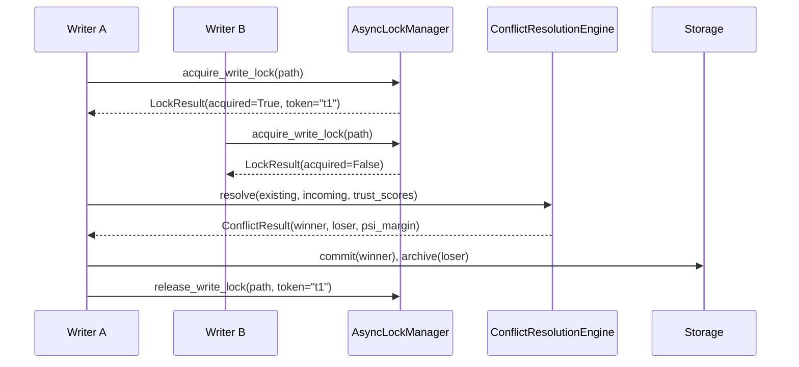
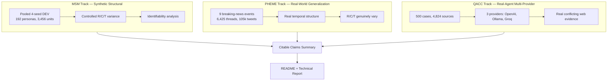

# Full Technical Report

**Date:** 2026-08-21  
**Repository:** Conflict Resolution Tracer (CRT)  
**Status:** Final — all numbers trace to `docs/_CITABLE_CLAIMS_MASTER_LIST.md`

---

## 1. Introduction & Problem Statement

Conflict Resolution Tracer (CRT) is deterministic multi-agent memory coherence middleware. When multiple agents write conflicting claims to the same memory key, CRT resolves the conflict using a fixed algebraic formula:

Ψ = (R + C + T) / 3

where:
- **R (Recency):** Exponential decay from the claim's timestamp, half-life = 30 days.
- **C (Confidence):** Provenance-derived confidence from the middleware confidence engine, based on source authority hierarchy.
- **T (Trust):** Dynamic agent reliability learned from historical TRAIN performance.

Provenance is a mandatory Stage-1 audit layer. It does NOT contribute a scalar term to Ψ. `authority_score` must be present for fail-closed compliance but is not an input to the resolution formula.

### Scientific Contribution

This repository provides rigorous, honest evaluation of the V1 Ψ mechanism across three independent tracks:

1. **MSM (Synthetic Structural):** Controlled experiments on pooled 4-seed synthetic data to test component identifiability, weight sensitivity, and guardrail behavior.
2. **PHEME (Real-World Generalization):** Human-adjudicated Twitter rumor verification data to test whether R, C, and T help when they genuinely vary.
3. **QACC (Real-Agent Multi-Provider):** Amazon Science's QA-with-Conflicting-Contexts benchmark with real LLM provider extraction to test multi-provider extraction behavior and resolver blindless.

The results are mixed. The mechanism is engineering-rigorous and fully reproducible, but accuracy on open-domain real-world data is modest, and several components are structurally unidentifiable on current benchmarks.

---

## 2. Architecture

### 2.1 Four-Stage Pipeline

Every write travels through the pipeline in order. The pipeline is the ONLY place that knows the stage order; each module can be swapped independently.

```mermaid
flowchart LR
    A[Agent Claim<br/>raw dict] --> B[Stage 1<br/>validate_and_stamp<br/>Provenance + Confidence]
    B --> C[Stage 2<br/>LoopDetector<br/>Oscillation check]
    C --> D[Stage 3<br/>AsyncLockManager<br/>Path-level write lock]
    D --> E[Stage 4<br/>ConflictResolutionEngine<br/>Ψ = (R + C + T) / 3]
    E --> F[Storage<br/>Commit winner, archive loser]
    F --> G[Optional<br/>AutoVerifier]
    G --> H[TrustManager<br/>record_outcome]
```

**Source:** `crt_core/pipeline.py` lines 1–24.

### 2.2 Ψ Calculation Flow

```mermaid
flowchart LR
    U[UMF Packet] --> P[ProvenanceInfo<br/>extraction]
    P --> R[R = e^(-λΔt)<br/>Recency decay]
    P --> C[C = verified_confidence<br/>from ProvenanceInfo]
    P --> T[T = trust_score<br/>from TrustManager]
    R --> W[weighted_total<br/>w_r·R + w_c·C + w_t·T]
    C --> W
    T --> W
    W --> CR[ConflictResult<br/>winner / loser / margin]
```

**Source:** `crt_core/conflict.py` lines 147–199.

### 2.3 Concurrency / Locking Sequence



**Source:** `crt_core/locking.py` lines 81–108; `crt_core/pipeline.py` lines 78–200.

**Important:** Concurrent mode shows spurious `pending_conflict` outcomes on distinct paths due to a middleware race (confirmed in `B2_pending_conflict_evidence.json`). Serial mode is deterministic.

### 2.4 Evaluation Architecture



**Track capabilities:**

| Track | Can test | Cannot test |
|-------|----------|-------------|
| MSM | Structural identifiability of R, C, T; weight sensitivity; guardrail behavior | Real-world extraction quality; provider behavior |
| PHEME | Generalization to real rumors; R/C/T variance | Trust calibration (single-domain); stance extraction quality |
| QACC | Real conflicting evidence; multi-provider extraction; provider-blind resolver | Recency/trust signal (neutral); groq model quality (rate-limited) |

---

## 3. Methodology per Track

### 3.1 MSM — Synthetic Structural

**What it can test:**
- Whether R, C, and T individually contribute to conflict resolution in a controlled setting where all three vary.
- How sensitive the mechanism is to weight changes (C/T ratio sweep, θ sweep).
- Whether the guardrail fires under adversarial conditions.
- Whether seed pooling changes the identifiability picture.

**What it cannot test:**
- Real-world LLM extraction quality.
- Whether the mechanism generalizes to human-adjudicated real events.
- Provider behavior differences.

**Key tables:**

| Weight Setting | Strict Accuracy | Coverage | Abstention |
|----------------|-----------------|----------|------------|
| full_crt (1/3,1/3,1/3) | 0.6441 | 0.5773 | 0.4227 |
| c_only (0,1,0) | 0.5576 | 0.8374 | 0.1626 |
| t_only (0,0,1) | 0.6392 | 0.5396 | 0.4604 |

**Source:** `SWEEP_PLAN_RESULTS.md` §A1.

**C/T ratio flatness:**

| C/T Ratio | w_c | w_t | Strict Accuracy | Coverage |
|-----------|-----|-----|-----------------|----------|
| 0.1 | 0.091 | 0.909 | 0.6418 | 0.6762 |
| 0.2 | 0.167 | 0.833 | **0.6429** | 0.6757 |
| 1.0 | 0.500 | 0.500 | 0.6388 | 0.6714 |
| 10.0 | 0.909 | 0.091 | 0.6278 | 0.6626 |

**Source:** `SWEEP_PLAN_RESULTS.md` §A2.4; `A2_full_sweep_curve.json`.

**Honest interpretation:** The C/T ratio is not a high-leverage parameter on MSM. The curve is remarkably flat (±1.5pp). The current 1/3-1/3-1/3 weights sit on a broad, stable plateau. Do NOT revise weights based on this dataset.

**Component identifiability (pooled):**

| Component | Single-Seed | Pooled (4 seeds) |
|-----------|-------------|------------------|
| R | 0.5894 (491/833) | 0.5883 (1963/3337) |
| C | 0.5702 (475/833) | 0.5776 (1927/3337) |
| T | 0.6519 (543/833) | 0.6619 (2209/3337) |

**Source:** `00_SEED_POOLING_REPORT.md` §3.3.

**Honest interpretation:** Pooling 4 seeds does not change the identifiability picture. The identifiability ceiling is a structural property of the benchmark generator, not a sampling artifact.

**Agent-claim gap:**

| Grounded Tier | Matchups | Agent Wins | Win Rate |
|---------------|----------|------------|----------|
| profile_ltm (0.90) | 297 | 0 | 0.00% |
| objective_log (0.85) | 1,728 | 0 | 0.00% |
| device_log (0.80) | 581 | 0 | 0.00% |

**Source:** `SWEEP_PLAN_RESULTS.md` §A4; `A4_agent_claim_gap.json`.

**Honest interpretation:** The 0/3,337 result is empirically robust on this corpus but NOT arithmetically guaranteed. The gap holds because favorable R/T conditions (R=1.0, T=1.0) do not occur in this corpus, not because the authority gap alone makes it impossible.

### 3.2 PHEME — Real-World Generalization

**What it can test:**
- Whether V1 can leverage R, C, and T when they genuinely vary in real-world data.
- Generalization beyond synthetic MSM to human-adjudicated rumor verification.

**What it cannot test:**
- Trust calibration (single-domain Twitter data; no per-user correctness tracking without stance gold).
- Stance extraction quality (deterministic lexicon-based, not SOTA).
- Thread-level gold mapped to tweet-level predictions introduces noise.

**Key table:**

| Method | Strict Accuracy | Coverage | Abstention |
|--------|-----------------|----------|------------|
| crt_v1 | 0.130 | 0.737 | 0.263 |
| last_write_wins | 0.160 | 1.000 | 0.000 |
| recency_only | 0.160 | 1.000 | 0.000 |
| majority_independent_source | 0.157 | 1.000 | 0.000 |

**Source:** `PHEME_FINAL_EVALUATION_REPORT.md` §TEST Results.

**Honest interpretation:** crt_v1 underperforms simple baselines on PHEME. The mechanism does not "solve" real-world conflict resolution; it is a controlled-engine test bed, not a production-ready rumor verifier.

**Component discrimination:**

| Component | Episodes Changed | Rate |
|-----------|------------------|------|
| R | 145/1950 | 7.44% |
| C | 593/1950 | 30.41% |
| T | 202/1950 | 10.36% |

**Source:** `PHEME_FINAL_EVALUATION_REPORT.md` §Component Discrimination.

**Honest interpretation:** C is the most active component on PHEME (30.41%), followed by T (10.36%) and R (7.44%). This contrasts with MSM where R and T were structurally invariant.

### 3.3 QACC — Real-Agent Multi-Provider

**What it can test:**
- Real conflicting web evidence with LLM extraction.
- Multi-provider extraction behavior and agreement rates.
- Provider-blind resolver verification.
- Open-domain factual question answering with conflicting contexts.

**What it cannot test:**
- Recency/trust signal (structurally neutral on QACC; R=0.5, T=0.5 for all claims).
- Groq model quality (84.4% rate-limit failure on current tier).
- Whether 42.86% agreement rate generalizes beyond n=7 measurable triples.

**Key table (openai + ollama clean subset):**

| policy | resolved | coverage | strict acc | selective acc |
|--------|----------|----------|------------|---------------|
| full_crt | 102/495 | 20.61% | 8.69% | 42.16% |
| c_only | 103/495 | 20.81% | 8.69% | 41.75% |
| last_write_wins | 443/495 | 89.49% | 34.34% | 38.37% |

**Source:** `QACC_500_MULTIPROVIDER_RESULTS.md` §3.

**Honest interpretation:** QACC coverage is low (20.61% for full_crt). The mechanism abstains on most open-domain conflicting contexts. last_write_wins resolves 89.49% of cases with higher strict accuracy (34.34%), though selective accuracy is lower (38.37%).

**Openai win-share finding:**

| provider | supported src | source share | resolved wins | win share | win/share ratio | mean authority |
|----------|---------------|--------------|---------------|-----------|-----------------|----------------|
| ollama | 799 | 57.15% | 49 | 48.04% | 0.84 | 0.7136 |
| openai | 599 | 42.85% | 53 | 51.96% | 1.21 | 0.7102 |

**Source:** `QACC_500_MULTIPROVIDER_RESULTS.md` §4.2; `RUN/analysis.json`.

**Wilson 95% CI for openai win rate:** [0.424, 0.614] (n=102).

**Honest interpretation:** OpenAI wins at a rate meaningfully above its source share. The effect is driven by longer supported claims (mean 16.53 vs 15.58 tokens), not higher authority or more frequent claims. Self-reported confidence was not captured, so the "more decisive" claim is supported only by token-length evidence.

**Agreement sub-check:**

| category | count |
|----------|-------|
| GENUINE_AGREEMENT | 3 |
| GENUINE_DISAGREEMENT | 4 |
| PARTIAL_DATA | 0 |
| NO_DATA | 23 |

**Measurable agreement rate:** 3/7 = 42.86%, Wilson 95% CI [0.158, 0.750].

**Source:** `QACC_500_MULTIPROVIDER_RESULTS.md` §4.4; `RUN/analysis.json`.

**Honest interpretation:** The original 0/30 figure is unreliable because 23/30 triples had fewer than 2 providers return a parseable claim (dominantly groq rate-limit failures). The correct measurable rate is 42.86% with a wide CI, reflecting the small n=7 base.

---

## 4. Cross-Cutting Findings

### 4.1 Concurrency Behavior

Serial mode is fully deterministic across repetitions. Concurrent mode is NOT deterministic for equal-authority real-agent claims: it produces spurious `pending_conflict` outcomes on distinct paths due to a middleware race.

**Source:** `B2_pending_conflict_evidence.json`; `results/empirical_evaluation/component_evaluation/real_agents/10_REAL_AGENT_VALIDATION_REPORT.json`.

### 4.2 Provenance Handling

Provenance is a mandatory Stage-1 audit layer. It does NOT contribute a scalar term to Ψ. The `authority_score` is derived solely from `source_type` (document=0.75, agent_claim=0.3, tool_output=0.85, etc.) and is provider-blind in QACC (0 mismatches across 4,823 assertions).

**Source:** `QACC_500_MULTIPROVIDER_RESULTS.md` §4.3; `RUN/analysis.json` `4_3_provider_blindness`.

### 4.3 Anti-Mock Verification

All provider calls in QACC are fail-closed on model identity. A mismatch or unavailable provider is a logged failure, never silent substitution. The independent validator passed 48/48 checks against the final analysis.json.

**Source:** `research_evaluation/_validator.py`; `QACC_500_MULTIPROVIDER_RESULTS.md` §5.

### 4.4 Frozen Assertion Principle

Each source's extraction happens exactly once and is reused identically across every policy compared downstream. No assertion is regenerated between policy runs.

**Source:** `RUN/_assertions_500_multiprovider.jsonl` (single file reused by all policies).

---

## 5. Limitations

This is one of the longest sections intentionally. These are genuine constraints that affect how the results should be interpreted.

1. **PHEME underperformance:** crt_v1 strict accuracy (13.0%) loses to last_write_wins (16.0%) and recency_only (16.0%) on real-world rumor verification. The mechanism does not outperform naive strategies on this task.

2. **QACC neutral trust/recency:** QACC provides no real trust or temporal signal. R and T are structurally fixed at 0.5 for every claim. Only C = authority_score(source_type) differentiates. This is a property of the dataset, not a code bug. Any policy that weights R or T differently cannot be properly evaluated on QACC.

3. **MSM flat C/T sensitivity:** The C/T weight ratio is not a high-leverage parameter on MSM. Sweeping it from 0.1 to 10.0 produces less than 1.5 percentage points of accuracy variation. The current 1/3-1/3-1/3 default sits on a broad, stable plateau.

4. **QACC low coverage:** full_crt resolves only 20.61% of QACC cases (102/495). The mechanism is highly abstentious on open-domain conflicting contexts.

5. **Groq rate-limit data quality:** 84.4% of groq-assigned QACC sources failed with HTTP 429 transport errors. No cross-provider comparison can include groq for this run.

6. **No G-subweight decomposition:** The current implementation has no provenance-aware G-component. EVIDENCE_AUTHORITY is flat per source type. C variance comes only from coverage differences.

7. **Guardrail inactivity:** The high-confidence-untrusted guardrail fired 0 times in 1,995 resolved episodes. It provides no safety value on current datasets.

8. **Pending conflict in concurrent mode:** The real_agents track found that concurrent mode produces spurious pending_conflict outcomes on distinct paths due to a middleware race. Serial mode is deterministic; concurrent mode is not for equal-authority real-agent claims.

9. **Agent-claim framing:** The 0/3,337 agent-claim result on MSM is empirically robust but not arithmetically guaranteed. It holds because favorable R/T conditions (R=1.0, T=1.0) do not occur in this corpus, not because the authority gap alone makes it impossible.

10. **C-vs-T contradiction:** The original claim that "T is dominant" is NOT supported by the data. Joint full_crt/c_only accuracy (0.6943) exceeds t_only accuracy (0.6853) on the same episodes. The "confident but wrong together" explanation is unsupported. The C-vs-T tension may be an artifact of comparing different metrics (agreement rate vs identifiability) rather than a real tension.

---

## 6. Future Work

1. **G-subweight decomposition:** Add provenance-aware G-component to C calculation. Only device_log and objective_log would show meaningful variance.

2. **Groq rerun:** Obtain higher-tier groq keys and rerun QACC extraction to fill the groq column.

3. **QACC trust/recency augmentation:** If QACC or a similar benchmark provides per-source trust or timestamp signals, re-evaluate whether R and T become identifiable.

4. **Concurrency fix:** Resolve the middleware race that causes spurious pending_conflict in concurrent mode.

5. **Confidence capture:** Add self-reported confidence to the QACC extraction schema to enable direct testing of the "more decisive" claim.

6. **Broader provider set:** Extend QACC extraction to additional providers (e.g., Anthropic Claude, Google Gemini) once rate limits allow.

---

## 7. Appendix: Full Citable Claims List

The complete citable-claims list with artifact pointers is maintained at:

`docs/_CITABLE_CLAIMS_MASTER_LIST.md`

Every number in this report traces to that list. If a number in an older draft or summary conflicts with the master list, the master list takes precedence and the conflict should be flagged in a footnote rather than silently choosing one version.
