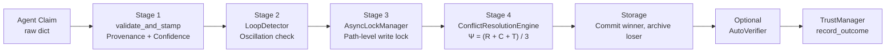
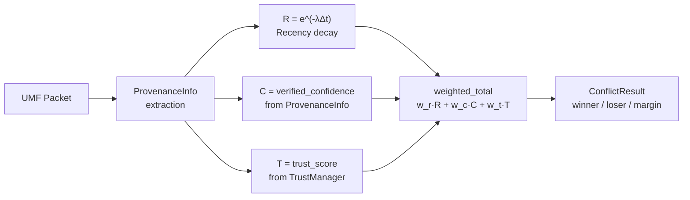
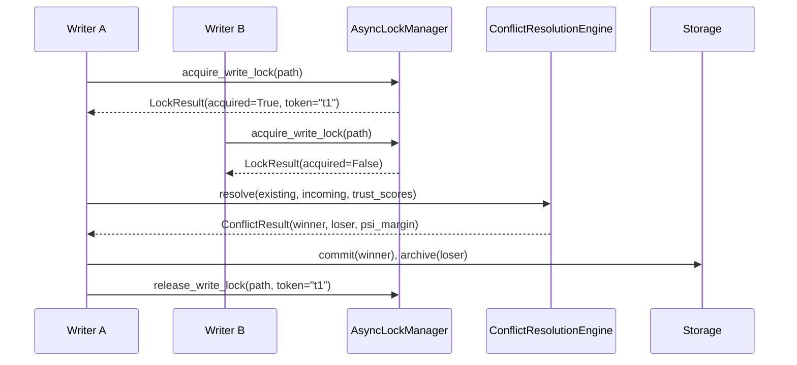
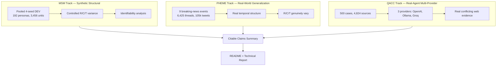

# CRT Architecture

This document contains the canonical architecture diagrams for the CRT repository. All diagrams are rendered as Mermaid code blocks for native GitHub rendering. No external tooling is required.

## Table of Contents

1. [Four-Stage Pipeline](#1-four-stage-pipeline)
2. [Ψ Calculation Flow](#2-ψ-calculation-flow)
3. [Concurrency / Locking Sequence](#3-concurrency--locking-sequence)
4. [Evaluation Architecture](#4-evaluation-architecture)

---

## 1. Four-Stage Pipeline

Every write from an agent travels through this pipeline in order. The pipeline is the ONLY place that knows the stage order; each module can be swapped independently.

**Source:** `crt_core/pipeline.py` lines 1–24.

---

## 2. Ψ Calculation Flow

The V1 conflict engine computes Ψ = (R + C + T) / 3. Provenance is a mandatory Stage-1 audit layer; it does NOT contribute a scalar term to Ψ.

**Source:** `crt_core/conflict.py` lines 147–199.

**Weights:** Default w_r = w_c = w_t = 1/3. All weights must sum to 1.0 (`ResolutionConfig.validate()`).

**Uncertainty threshold:** |Ψ_A - Ψ_B| < θ → unresolved. Default θ = 0.05.

---

## 3. Concurrency / Locking Sequence

Two concurrent writers attempting to write to the same path. The lock manager uses token-based acquire/release. The owner-token fix ensures only the holder can release.

**Source:** `crt_core/locking.py` lines 81–108; `crt_core/pipeline.py` lines 78–200.

**Note:** Concurrent mode shows spurious `pending_conflict` outcomes on distinct paths due to a middleware race (confirmed in `results/empirical_evaluation/msm/_sweep_results/B2_pending_conflict_evidence.json`). Serial mode is deterministic.

---

## 4. Evaluation Architecture

Three independent evaluation tracks feed into the citable-claims summary. Each track has distinct capabilities and limitations.

**Track capabilities:**

| Track | Can test | Cannot test |
|-------|----------|-------------|
| MSM | Structural identifiability of R, C, T; weight sensitivity; guardrail behavior | Real-world extraction quality; provider behavior |
| PHEME | Generalization to real rumors; R/C/T variance | Trust calibration (single-domain); stance extraction quality |
| QACC | Real conflicting evidence; multi-provider extraction; provider-blind resolver | Recency/trust signal (neutral); groq model quality (rate-limited) |

**Full reports:**
- MSM: `results/empirical_evaluation/msm/_sweep_results/SWEEP_PLAN_RESULTS.md`
- PHEME: `results/empirical_evaluation/pheme_test/PHEME_FINAL_EVALUATION_REPORT.md`
- QACC: `results/empirical_evaluation/component_evaluation/qacc/_frozen_assertions_500_multiprovider/QACC_500_MULTIPROVIDER_RESULTS.md`
